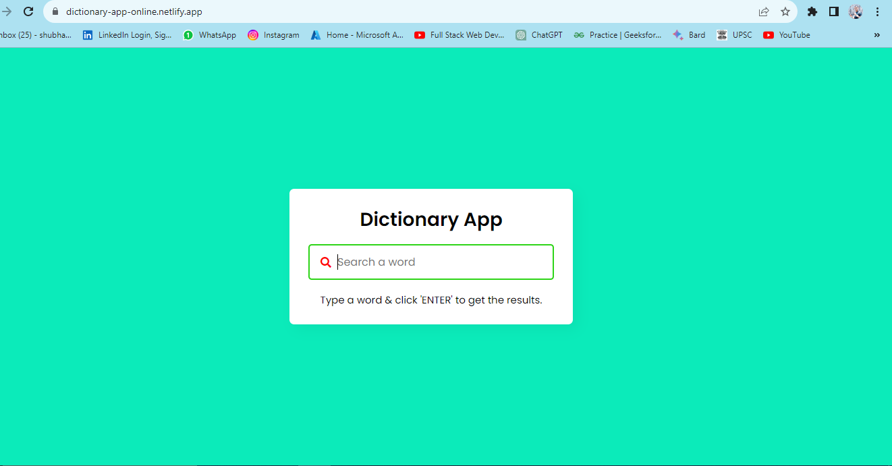
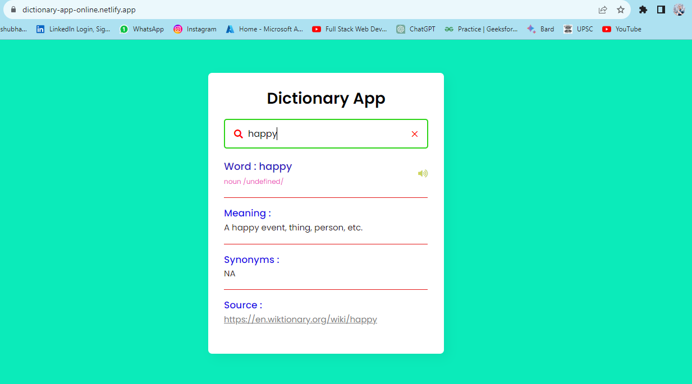

# Dictionary App 

An Awesome Dictionary app created using HTML, CSS, JavaScript....

## [View Demo](https://dictionary-app-online.netlify.app/)

## About The Project:
-  A simple JavaScript project Dictionary app. 
-  You can search different words meaning in just one click...

## Built With:
HTML, CSS, JavaScript

## Usage:
-  button to search meaning of any type of word.

## Authors
-  [Shubham Bhoite](https://github.com/Shubham-Bhoite) - 3rd year Comp Sci Student.
